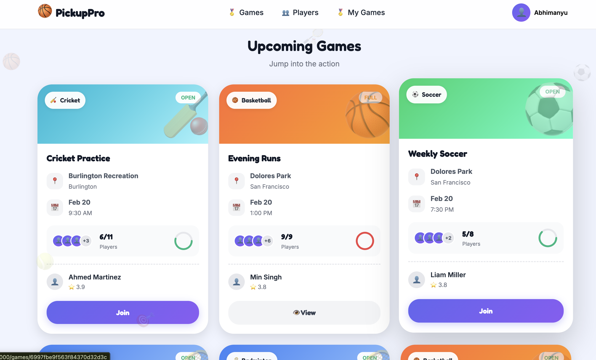

# 🏀 PickupPro

**Find Your Next Game. Play Your Best.**

PickupPro is a community-driven platform that connects local athletes looking to play casual pickup sports games. Create games, join with one click, and build your reputation through player ratings.



---

## 📋 Project Information

|                 |                                                                                     |
| --------------- | ----------------------------------------------------------------------------------- |
| **Authors**     | Kashish Rahulbhai Khatri & Abhimanyu Dudeja                                         |
| **Course**      | CS5610 Web Development                                                              |
| **Institution** | Northeastern University - Khoury College                                            |
| **Class Link**  | [CS5610 Web Development](https://johnguerra.co/classes/webDevelopment_online_spring_2026/) |
| **Semester**    | Spring 2026                                                                         |
| **License**     | MIT                                                                                 |

---

## 🎯 Project Objective

PickupPro solves the coordination problem for pickup sports games:

- **For Newcomers**: Easily discover and join local games without knowing anyone
- **For Organizers**: Stop chasing confirmations in group chats; let players self-organize
- **For Cautious Players**: Check player reputations before joining to ensure a good experience

### Supported Sports

🏀 Basketball • ⚽ Soccer • 🎾 Tennis • 🏐 Volleyball • ⚾ Baseball • 🏏 Cricket • 🏸 Badminton • 🏃 Running

---

## ✨ Features

### Games Management (Kashish Rahulbhai Khatri)

- Create pickup games with sport, location, date, time, and player limits
- Browse and filter games by sport, date, and location
- Join games or automatically join waitlist when full
- Leave games (spots open for waitlisted players)
- Host can edit, cancel, or mark games as completed
- View and manage game rosters

### User Profiles & Reputation (Abhimanyu Dudeja)

- Create and edit profile with sports interests and skill levels
- Rate players on sportsmanship after completed games
- View own profile with average rating and rating history
- View other players' profiles with ratings and game history
- Search and discover players in the community

---

## 🛠️ Tech Stack

| Layer              | Technology                                              |
| ------------------ | ------------------------------------------------------- |
| **Frontend**       | Vanilla JavaScript, HTML5, CSS3 (Client-Side Rendering) |
| **Backend**        | Node.js, Express.js (ES Modules)                        |
| **Database**       | MongoDB (Native Driver - No Mongoose)                   |
| **Authentication** | JWT (JSON Web Tokens)                                   |
| **Deployment**     | Docker, Render.com                                      |

---

## 📁 Project Structure

```
pickuppro/
├── src/
│   ├── db/
│   │   ├── connection.js      # MongoDB connection module
│   │   └── seed.js            # Database seeding (1000+ games)
│   ├── routes/
│   │   ├── auth.js            # Authentication routes
│   │   ├── games.js           # Games CRUD routes (Kashish)
│   │   ├── users.js           # User profile routes (Abhimanyu)
│   │   └── ratings.js         # Rating routes (Abhimanyu)
│   ├── middleware/
│   │   ├── auth.js            # JWT authentication
│   │   └── errorHandler.js    # Error handling
│   └── server.js              # Express server entry point
├── public/
│   ├── css/
│   │   ├── modules/           # CSS variables, reset, typography, layout
│   │   └── components/        # Button, form, card, modal, navbar styles
│   ├── js/
│   │   ├── modules/           # API, auth, router, toast, modal, utils
│   │   └── app.js             # Main application with routes
│   ├── assets/                # Static assets
│   └── index.html             # SPA entry point
├── docker-compose.yml         # Local development with MongoDB
├── Dockerfile                 # Production container
├── render.yaml                # Render deployment config
├── package.json               # Dependencies and scripts
├── eslint.config.js           # ESLint configuration
├── .prettierrc                # Prettier configuration
├── DESIGN.md                  # Design document
├── LICENSE                    # MIT License
└── README.md                  # This file
```

---

## 🚀 Getting Started

### Prerequisites

- **Node.js** 18+ ([Download](https://nodejs.org/))
- **Docker** & **Docker Compose** ([Download](https://www.docker.com/))
- **Git** ([Download](https://git-scm.com/))

### Installation

1. **Clone the repository**

   ```bash
   git clone https://github.com/yourusername/pickuppro.git
   cd pickuppro
   ```

2. **Install dependencies**

   ```bash
   npm install
   ```

3. **Set up environment variables**
   ```bash
   cp .env.example .env
   # Edit .env with your configuration
   ```

### Running with Docker (Recommended)

1. **Start the application and MongoDB**

   ```bash
   docker-compose up -d
   ```

2. **Seed the database with 1000+ games**

   ```bash
   docker-compose --profile seed up seed
   ```

3. **Access the application**
   - Open http://localhost:3000 in your browser

4. **Stop the application**
   ```bash
   docker-compose down
   ```

### Running without Docker

1. **Start MongoDB** (must be running locally on port 27017)

2. **Update .env**

   ```
   MONGODB_URI=mongodb://localhost:27017/pickuppro
   ```

3. **Seed the database**

   ```bash
   npm run seed
   ```

4. **Start the development server**

   ```bash
   npm run dev
   ```

5. **Access the application**
   - Open http://localhost:3000 in your browser

---

## 📊 Database Setup

### Collections

The application uses 3 MongoDB collections:

1. **users** - User accounts and profiles
2. **games** - Pickup games (1000+ records after seeding)
3. **ratings** - Player ratings and reviews

### Seeding

The seed script creates:

- 100+ user accounts
- **1000+ games** (historical and upcoming) - Boston area focused
- Thousands of ratings for completed games

**Demo Account:**

- Email: `demo@pickuppro.com`
- Password: `demo123`

---

## 🌐 Deployment to Render

### Prerequisites

- [Render.com](https://render.com/) account
- [MongoDB Atlas](https://www.mongodb.com/atlas) free cluster

### Steps

1. **Create MongoDB Atlas Cluster**
   - Sign up at MongoDB Atlas
   - Create a free M0 cluster
   - Create a database user
   - Whitelist `0.0.0.0/0` for Render access
   - Copy the connection string

2. **Deploy to Render**

   Option A: Using render.yaml
   - Push code to GitHub
   - Connect GitHub repo to Render
   - Use "Blueprint" to deploy from render.yaml

   Option B: Manual setup
   - Create new "Web Service" on Render
   - Connect your GitHub repository
   - Set environment to "Docker"
   - Add environment variables:
     - `MONGODB_URI`: Your MongoDB Atlas connection string
     - `JWT_SECRET`: A secure random string
     - `NODE_ENV`: production

3. **Seed Production Database**

   ```bash
   # Run seed script with production MongoDB URI
   MONGODB_URI="your-atlas-uri" npm run seed
   ```

4. **Access your deployed app**
   - Render will provide a URL like `https://pickuppro.onrender.com`

---

## 📝 API Documentation

### Authentication

| Method | Endpoint             | Description       |
| ------ | -------------------- | ----------------- |
| POST   | `/api/auth/register` | Register new user |
| POST   | `/api/auth/login`    | Login user        |
| GET    | `/api/auth/me`       | Get current user  |

### Games (Kashish Rahulbhai Khatri)

| Method | Endpoint                  | Description             |
| ------ | ------------------------- | ----------------------- |
| GET    | `/api/games`              | List games with filters |
| GET    | `/api/games/:id`          | Get game details        |
| POST   | `/api/games`              | Create game             |
| PUT    | `/api/games/:id`          | Update game             |
| DELETE | `/api/games/:id`          | Cancel game             |
| POST   | `/api/games/:id/join`     | Join game/waitlist      |
| POST   | `/api/games/:id/leave`    | Leave game              |
| PUT    | `/api/games/:id/complete` | Mark completed          |

### Users (Abhimanyu Dudeja)

| Method | Endpoint                 | Description         |
| ------ | ------------------------ | ------------------- |
| GET    | `/api/users`             | Search users        |
| GET    | `/api/users/:id`         | Get user profile    |
| PUT    | `/api/users/:id`         | Update profile      |
| GET    | `/api/users/:id/games`   | User's game history |
| GET    | `/api/users/:id/ratings` | User's ratings      |

### Ratings (Abhimanyu Dudeja)

| Method | Endpoint                | Description        |
| ------ | ----------------------- | ------------------ |
| POST   | `/api/ratings`          | Rate a player      |
| GET    | `/api/ratings/game/:id` | Ratings for a game |
| GET    | `/api/ratings/pending`  | Pending ratings    |

---

## 🧪 Code Quality

```bash
# Run ESLint
npm run lint

# Fix ESLint issues
npm run lint:fix

# Format with Prettier
npm run format

# Check formatting
npm run format:check
```

---

## 🎥 Demo Video

Demo video submitted via Google Form.

---

## 📄 License

This project is licensed under the MIT License - see the [LICENSE](LICENSE) file for details.

---

## 🙏 Acknowledgments

- Professor John Alexis Guerra Gomez for the course guidance
- Northeastern University Khoury College
- The open-source community

---

_Built with ❤️ for CS5610 Web Development at Northeastern University_
